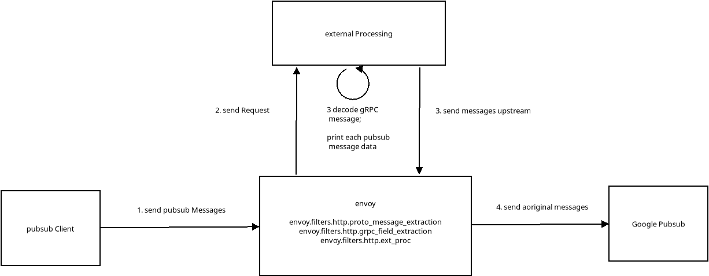

## Envoy External Processing filter for decoding Google gRPC PubSub Messages

Just an envoy proxy that decodes and prints google pubsub messages.

This configuration will use three mechanisms to parse the inbound grpc message:

1. `envoy.filters.http.proto_message_extraction`
2. `envoy.filters.http.grpc_field_extraction`
3. `envoy.filters.http.ext_proc`

The first two cannot all message types but the third done can.

Basically, another variation of these article

- [Decoding gRPC Messages using Envoy](https://blog.salrashid.dev/articles/2022/envoy_grpc_decode/)
- [Envoy Dynamic Forward Proxy configuration with Downstream SNI for Google APIs and httpbin](https://blog.salrashid.dev/articles/2022/envoy_dynamic_forward_proxy_with_sni/)



Note, if you have the proto descriptors handy and just want to decode envoy metadata, see [Using envoy.filters.http.grpc_field_extraction](https://github.com/salrashid123/envoy_grpc_decode?tab=readme-ov-file#using-envoyfiltershttpgrpc_field_extraction)


At the moment, the proxy just decodes the messages and sends the original message as-is upstream to gcp.

if you want, you can alter the data code to optionally encrypt some fields or add payload metadata to each request or response.  Or even filter based on the topic the messages are intended for.

The current filter just inspects pubsub messages but your'e free to alter it for any Google GCP gRPC service or even easier, HTTP/Rest service

The setup is easy

```bash
# create a topic to send messages to 
gcloud pubsub topics create topic1
gcloud pubsub subscriptions create ff1-subscribe --topic=topic1
```

Then run the filter

```bash
cd ext_proc/
go run filter.go
```

Run envoy
```bash
docker cp `docker create envoyproxy/envoy:contrib-dev`:/usr/local/bin/envoy /tmp/

/tmp/envoy -c envoy_server.yaml -l debug
```

Run  pubsub client
```bash
cd pubsub_client/
go run main.go --projectID $PROJECT_ID
```


---

### Pubsub Client

```bash
$ go run main.go 
Published message msg ID: 6016065317030901
Published message msg ID: 6016065317030900
```

#### External Processor logs

```log
$ go run filter.go 
2025/01/18 09:57:02 Starting server...
2025/01/18 09:57:21 Handling grpc Check request + service:"envoy.service.ext_proc.v3.ExternalProcessor"
2025/01/18 09:57:26 Handling grpc Check request + service:"envoy.service.ext_proc.v3.ExternalProcessor"
2025/01/18 09:57:27 Got stream:  -->  
2025/01/18 09:57:27 pb.ProcessingRequest_RequestHeaders &{headers:{headers:{key:":method" raw_value:"POST"} headers:{key:":scheme" raw_value:"https"} headers:{key:":path" raw_value:"/google.pubsub.v1.Publisher/Publish"} headers:{key:":authority" raw_value:"pubsub.googleapis.com"} headers:{key:"content-type" raw_value:"application/grpc"} headers:{key:"user-agent" raw_value:"grpc-go/1.48.0"} headers:{key:"te" raw_value:"trailers"} headers:{key:"grpc-timeout" raw_value:"59862524u"} headers:{key:"authorization" raw_value:"Bearer ..."} headers:{key:"x-goog-user-project" raw_value:"core-eso"} headers:{key:"grpc-tags-bin" raw_value:"AAAFdG9waWMfcHJvamVjdHMvY29yZS1lc28vdG9waWNzL3RvcGljMQAGc3RhdHVzAk9L"} headers:{key:"x-goog-api-client" raw_value:"gl-go/1.23.4 gccl/1.25.1 gapic/1.25.1 gax/2.4.0 grpc/1.48.0"} headers:{key:"x-goog-request-params" raw_value:"topic=projects%2Fcore-eso%2Ftopics%2Ftopic1"} headers:{key:"grpc-trace-bin" raw_value:"AAA8h5xy+IO8ZIYns3mPYKn3Act1wtHTqVLuAgA"} headers:{key:"x-forwarded-proto" raw_value:"https"} headers:{key:"x-request-id" raw_value:"7cc52095-a169-4349-a258-2254cece0d32"}}} 
2025/01/18 09:57:27 Got RequestHeaders.Attributes map[]

2025/01/18 09:57:27 Got RequestHeaders.Headers headers:{key:":method" raw_value:"POST"} headers:{key:":scheme" raw_value:"https"} headers:{key:":path" raw_value:"/google.pubsub.v1.Publisher/Publish"} headers:{key:":authority" raw_value:"pubsub.googleapis.com"} headers:{key:"content-type" raw_value:"application/grpc"} headers:{key:"user-agent" raw_value:"grpc-go/1.48.0"} headers:{key:"te" raw_value:"trailers"} headers:{key:"grpc-timeout" raw_value:"59862524u"} headers:{key:"authorization" raw_value:"Bearer ya29...5"} headers:{key:"x-goog-user-project" raw_value:"core-eso"} headers:{key:"grpc-tags-bin" raw_value:"AAAFdG9waWMfcHJvamVjdHMvY29yZS1lc28vdG9waWNzL3RvcGljMQAGc3RhdHVzAk9L"} headers:{key:"x-goog-api-client" raw_value:"gl-go/1.23.4 gccl/1.25.1 gapic/1.25.1 gax/2.4.0 grpc/1.48.0"} headers:{key:"x-goog-request-params" raw_value:"topic=projects%2Fcore-eso%2Ftopics%2Ftopic1"} headers:{key:"grpc-trace-bin" raw_value:"AAA8h5xy+IO8ZIYns3mPYKn3Act1wtHTqVLuAgA"} headers:{key:"x-forwarded-proto" raw_value:"https"} headers:{key:"x-request-id" raw_value:"7cc52095-a169-4349-a258-2254cece0d32"}

2025/01/18 09:57:27 Header :method POST
2025/01/18 09:57:27    RequestBody: A
projects/core-eso/topics/topic1

foo number 0

foo number 1
2025/01/18 09:57:27 >>>>>>>>>>>>>>>> Got message for topic: projects/core-eso/topics/topic1
Decode PubsubMessage Data ---->  foo number 0
Decode PubsubMessage Data ---->  foo number 1


```


### Envoy Logs

```log
[2025-01-18 09:57:27.005][351270][debug][http] [source/common/http/conn_manager_impl.cc:393] [Tags: "ConnectionId":"3"] new stream
[2025-01-18 09:57:27.005][351270][debug][http] [source/common/http/conn_manager_impl.cc:1160] [Tags: "ConnectionId":"3","StreamId":"15637459028729789041"] request headers complete (end_stream=false):
':method', 'POST'
':scheme', 'https'
':path', '/google.pubsub.v1.Publisher/Publish'
':authority', 'pubsub.googleapis.com'
'content-type', 'application/grpc'
'user-agent', 'grpc-go/1.48.0'
'te', 'trailers'
'grpc-timeout', '59862524u'
'authorization', 'Bearer ya29.redacted'
'x-goog-user-project', 'core-eso'
'grpc-tags-bin', 'AAAFdG9waWMfcHJvamVjdHMvY29yZS1lc28vdG9waWNzL3RvcGljMQAGc3RhdHVzAk9L'
'x-goog-api-client', 'gl-go/1.23.4 gccl/1.25.1 gapic/1.25.1 gax/2.4.0 grpc/1.48.0'
'x-goog-request-params', 'topic=projects%2Fcore-eso%2Ftopics%2Ftopic1'
'grpc-trace-bin', 'AAA8h5xy+IO8ZIYns3mPYKn3Act1wtHTqVLuAgA'


[2025-01-18 09:57:27.005][351270][debug][misc] [source/extensions/filters/http/proto_message_extraction/extractor_impl.cc:46] Extracted fields: fields {
  key: "@type"
  value {
    string_value: "type.googleapis.com/google.pubsub.v1.PublishRequest"
  }
}
fields {
  key: "topic"
  value {
    string_value: "projects/core-eso/topics/topic1"
  }
}

[2025-01-18 09:57:27.005][351270][debug][filter] [source/extensions/filters/http/proto_message_extraction/filter.cc:389] [Tags: "ConnectionId":"3","StreamId":"15637459028729789041"] Injected request dynamic metadata `envoy.filters.http.proto_message_extraction` with `fields {
  key: "requests"
  value {
    struct_value {
      fields {
        key: "first"
        value {
          struct_value {
            fields {
              key: "@type"
              value {
                string_value: "type.googleapis.com/google.pubsub.v1.PublishRequest"
              }
            }
            fields {
              key: "topic"
              value {
                string_value: "projects/core-eso/topics/topic1"
              }
            }
          }
        }
      }
    }
  }
}
`


[2025-01-18 09:57:27.006][351270][debug][misc] [source/extensions/filters/http/grpc_field_extraction/extractor_impl.cc:47] extracted the following resource values from the topic field: list_value {
  values {
    string_value: "projects/core-eso/topics/topic1"
  }
}

[2025-01-18 09:57:27.006][351270][debug][filter] [source/extensions/filters/http/grpc_field_extraction/filter.cc:221] [Tags: "ConnectionId":"3","StreamId":"15637459028729789041"] injected dynamic metadata `envoy.filters.http.grpc_field_extraction` with `fields {
  key: "topic"
  value {
    list_value {
      values {
        string_value: "projects/core-eso/topics/topic1"
      }
    }
  }
}
`
[2025-01-18 09:57:27.006][351270][info][misc] [source/extensions/filters/http/grpc_field_extraction/message_converter/message_converter.cc:149] converted back len(raw_message)=65, len(output_message)=70
[2025-01-18 09:57:27.006][351270][debug][filter] [source/extensions/filters/http/grpc_field_extraction/filter.cc:195] [Tags: "ConnectionId":"3","StreamId":"15637459028729789041"] decodeData: convert back data size=70
[2025-01-18 09:57:27.006][351270][debug][ext_proc] [source/extensions/filters/http/ext_proc/ext_proc.cc:340] Opening gRPC stream to external processor
[2025-01-18 09:57:27.006][351270][debug][router] [source/common/router/router.cc:527] [Tags: "ConnectionId":"0","StreamId":"14222310877270232499"] cluster 'ext_proc_cluster' match for URL '/envoy.service.ext_proc.v3.ExternalProcessor/Process'
[2025-01-18 09:57:27.007][351270][debug][router] [source/common/router/router.cc:756] [Tags: "ConnectionId":"0","StreamId":"14222310877270232499"] router decoding headers:
':method', 'POST'
':path', '/envoy.service.ext_proc.v3.ExternalProcessor/Process'
':authority', 'ext_proc_cluster'
':scheme', 'http'
'te', 'trailers'
'content-type', 'application/grpc'
'x-envoy-internal', 'true'
'x-forwarded-for', '192.168.1.160'


[2025-01-18 09:57:27.023][351244][debug][forward_proxy] [source/extensions/common/dynamic_forward_proxy/dns_cache_impl.cc:490] DNS refresh rate reset for host 'pubsub.googleapis.com:443', refresh rate 285000 ms
[2025-01-18 09:57:27.024][351270][debug][forward_proxy] [source/extensions/filters/http/dynamic_forward_proxy/proxy_filter.cc:416] [Tags: "ConnectionId":"3","StreamId":"15637459028729789041"] load DNS cache complete, continuing after adding resolved host: pubsub.googleapis.com
[2025-01-18 09:57:27.024][351270][debug][router] [source/common/router/router.cc:527] [Tags: "ConnectionId":"3","StreamId":"15637459028729789041"] cluster 'dynamic_forward_proxy_cluster' match for URL '/google.pubsub.v1.Publisher/Publish'
[2025-01-18 09:57:27.024][351270][debug][router] [source/common/router/router.cc:756] [Tags: "ConnectionId":"3","StreamId":"15637459028729789041"] router decoding headers:
':method', 'POST'
':scheme', 'https'
':path', '/google.pubsub.v1.Publisher/Publish'
':authority', 'pubsub.googleapis.com'
'content-type', 'application/grpc'
'user-agent', 'grpc-go/1.48.0'
'te', 'trailers'
'grpc-timeout', '59862524u'
'authorization', 'Bearer ya29.'
'x-goog-user-project', 'core-eso'
'grpc-tags-bin', 'AAAFdG9waWMfcHJvamVjdHMvY29yZS1lc28vdG9waWNzL3RvcGljMQAGc3RhdHVzAk9L'
'x-goog-api-client', 'gl-go/1.23.4 gccl/1.25.1 gapic/1.25.1 gax/2.4.0 grpc/1.48.0'
'x-goog-request-params', 'topic=projects%2Fcore-eso%2Ftopics%2Ftopic1'
'grpc-trace-bin', 'AAA8h5xy+IO8ZIYns3mPYKn3Act1wtHTqVLuAgA'
'x-forwarded-proto', 'https'
'x-request-id', '7cc52095-a169-4349-a258-2254cece0d32'
'x-envoy-expected-rq-timeout-ms', '15000'


[2025-01-18 09:57:27.139][351270][debug][filter] [source/extensions/filters/http/proto_message_extraction/filter.cc:277] [Tags: "ConnectionId":"3","StreamId":"15637459028729789041"] encodeData: data size=43 end_stream=false

[2025-01-18 09:57:27.139][351270][info][misc] [source/extensions/filters/http/grpc_field_extraction/message_converter/message_converter.cc:154] 43 + 0
[2025-01-18 09:57:27.139][351270][info][misc] [source/extensions/filters/http/grpc_field_extraction/message_converter/message_converter.cc:32] Checking buffer limits: actual 43 > limit 268435456?
[2025-01-18 09:57:27.139][351270][info][misc] [source/extensions/filters/http/grpc_field_extraction/message_converter/message_converter.cc:154] 43 + 0
[2025-01-18 09:57:27.139][351270][debug][misc] [./source/extensions/filters/http/grpc_field_extraction/message_converter/stream_message.h:22] owned len(owned_bytes_)=38
[2025-01-18 09:57:27.139][351270][info][misc] [source/extensions/filters/http/grpc_field_extraction/message_converter/message_converter.cc:62] len(parsing_buffer_)=0
[2025-01-18 09:57:27.139][351270][info][misc] [source/extensions/filters/http/grpc_field_extraction/message_converter/message_converter.cc:154] 0 + 38
[2025-01-18 09:57:27.139][351270][info][misc] [source/extensions/filters/http/grpc_field_extraction/message_converter/message_converter.cc:32] Checking buffer limits: actual 38 > limit 268435456?
[2025-01-18 09:57:27.139][351270][info][misc] [source/extensions/filters/http/grpc_field_extraction/message_converter/message_converter.cc:154] 0 + 38
[2025-01-18 09:57:27.139][351270][info][misc] [source/extensions/filters/http/grpc_field_extraction/message_converter/message_converter_utility.cc:26] Need more data for gRPC frame header parsing. Current size=0
[2025-01-18 09:57:27.139][351270][info][misc] [source/extensions/filters/http/grpc_field_extraction/message_converter/message_converter.cc:49] expecting more data for gRPC message parsing
[2025-01-18 09:57:27.139][351270][debug][misc] [source/extensions/filters/http/proto_message_extraction/extractor_impl.cc:46] Extracted fields: fields {
  key: "@type"
  value {
    string_value: "type.googleapis.com/google.pubsub.v1.PublishResponse"
  }
}

[2025-01-18 09:57:27.139][351270][debug][filter] [source/extensions/filters/http/proto_message_extraction/filter.cc:423] [Tags: "ConnectionId":"3","StreamId":"15637459028729789041"] Injected response dynamic metadata `envoy.filters.http.proto_message_extraction` with `fields {
  key: "responses"
  value {
    struct_value {
      fields {
        key: "first"
        value {
          struct_value {
            fields {
              key: "@type"
              value {
                string_value: "type.googleapis.com/google.pubsub.v1.PublishResponse"
              }
            }
          }
        }
      }
    }
  }
}
`

[2025-01-18 09:57:27.139][351270][debug][http] [source/common/http/conn_manager_impl.cc:1849] [Tags: "ConnectionId":"3","StreamId":"15637459028729789041"] encoding headers via codec (end_stream=false):
':status', '200'
'content-disposition', 'attachment'
'content-type', 'application/grpc'
'date', 'Sat, 18 Jan 2025 14:57:27 GMT'
'alt-svc', 'h3=":443"; ma=2592000,h3-29=":443"; ma=2592000'
'x-envoy-upstream-service-time', '114'
'server', 'envoy'
```

---

### Filter extraction limits

For  `envoy.filters.http.proto_message_extraction` and `envoy.filters.http.grpc_field_extraction`

you'll need the protodescriptors.  You can either use the protodescritor in this repo or to generate the protodescriptors by hand:


```bash
git clone https://github.com/googleapis/api-common-protos /tmp/api-common-protos
git clone https://github.com/googleapis/googleapis.git

protoc -I /tmp/api-common-protos -I.    --descriptor_set_out=google/pubsub/v1/pubsub.proto.pb    --include_imports      google/pubsub/v1/pubsub.proto
```

Note that the pubsub publish message format;

```proto

message PublishRequest {
  string topic = 1 [
    (google.api.field_behavior) = REQUIRED,
    (google.api.resource_reference) = { type: "pubsub.googleapis.com/Topic" }
  ];
  repeated PubsubMessage messages = 2 [(google.api.field_behavior) = REQUIRED];
}

message PubsubMessage {

  bytes data = 1 [(google.api.field_behavior) = OPTIONAL];
  map<string, string> attributes = 2 [(google.api.field_behavior) = OPTIONAL];
  string message_id = 3;
  google.protobuf.Timestamp publish_time = 4;
  string ordering_key = 5 [(google.api.field_behavior) = OPTIONAL];
}
```

a limitation of the automatic extractor is that its limited: eg, if you try to extract `message.data` field within the envoy config, you'll see:

   `couldn't init extractor for method `google.pubsub.v1.Publisher.Publish`: leaf node 'data' must be numerical/string or timestamp type`
